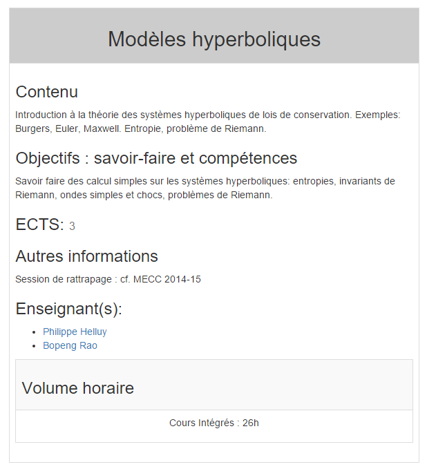
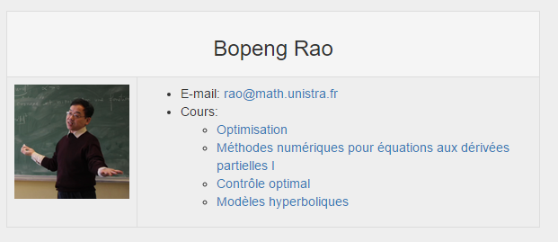

#Jekyll Tips And Tricks
## The file structure and URL routing

Here is the basic directory struct of a Jekyll website:

```
.
├── _config.yml
├── _includes
|   ├── footer.html
|   └── header.html
├── _layouts
|   ├── default.html
|   └── post.html
├── _posts
|   ├── 2007-10-29-why-every-programmer-should-play-nethack.markdown
|   └── 2009-04-26-barcamp-boston-4-roundup.markdown
├── _data
|   └── members.yml
├── _site
├── ._config.yml
└── index.html
```

When user visits firstly the website, the index.html will be visited. All `html` and `markdown` files are going to be transformed when we run `jekyll build` command. Jekyll uses a YAML Front Matter section in these files in order to organise the website routing.

```yaml
---
layout: default
---
```

When jekyll encounters `layout: default`, it will go to `_layout` folder and find a file called `default.html`.

And this is what i put into the `default.html` file.

```html
<!DOCTYPE html>
<html lang="fr">

  

  <body>

    


    {{ content }}

    

    

    

    


  </body>

</html>
```
Its barely a standard html file, but with some Liquid template language. 
The `` code snippet means the default layout will include the `head.html` in `_include` folder. And the `{{ content }}` is a very important part of page rendering. It is the variation part of you whole basic html skeleton.
For example, if the user visits `csmi.cemosis.fr/team/`. It will in fact visits the `default.html` + team.md file's code inserted into the `{{ content }}` part.

```html
---
layout: default
permalink: /team/
---

<center style="padding-top:80px"><h2>&Eacute;quipe pédagogique</h2></center>

<div class="container" style="max-width:500px">



	<table class="table table-bordered table-hover table-striped" style="margin-top:50px">
		<tbody>
		<tr>
			<td style="text-align:center">{{ member.position }}</td>
		</tr>
		<tr>
			<td>
				<ul>

					<li>{{ member.name }}</li>
					<li>Bureau: {{ member.office }}</li>
					<li>E-mail: <a href="mailto:{{ member.email }}">{{ member.email }}</a></li>
					<li>Téléphone: {{ member.telephone }}</li>
				</ul>
			</td>
		</tr>
		</tbody>
	</table>



</div>

```

There is two way to set up website routing. The first is to create a markdown file in the root directory and use YAML front matter to set permalink. Just like i made the team page, i need to specify that it uses default layout and its URL is /team/.

The other way is to create a folder named team and to recreate an index.html file. This way serve better when creating more complex pages. For example, i want to created a news pages with severals layers of html layout. I must create a news folder and an index.html file in that folder.
```html
---
layout: news
permalink: /news/
author: all
---


	

```
I specified this page has a permanent link `/news/` and i choice a layout other than the basic default layout that i created.

## A "database" between professors and courses
Firstly, prepare data YAML files:
course.yml
```yaml
- name: Algorithmique I
  ects: 3
  content: Algorithmes algébriques, algorithmes de tris. Estimations asymptotiques.
  knowledege: La sensibilité aux coûts et performances d'algorithmes variés. Savoir déterminer une complexité maximale et une complexité en moyenne.
  info: "Session de rattrapage : cf. MECC 2014-15"
  duration: "Cours Intégrés : 26h"
  id: s1-1
  teacher: m5;

- name: Algorithmique II
  ects: 3
  content: Recherche de motifs, parcours de graphes orientés, techniques mathématiques
  knowledege: Approfondir les compétences abordées en algorithmique I
  info: "Session de rattrapage : cf. MECC 2014-15"
  duration: "Cours Intégrés : 26h"
  id: s1-2
  teacher: m5;

- name: Analyse fonctionnelle
  ects: 3
  content: "Eléments d'analyse fonctionnelle utiles pour le calcul scientifique et les mathématiques pour l'ingénieur: rappels de théorie de la mesure et d'analyse convexe, espaces de Hilbert de dimension infinie, convergences faibles, distributions."
  knowledege: Savoir distinguer sur le plan théorique et pratique les diverses notions de convergence en dimension finie ou infinie. Pratique du calcul avec les distributions.
  info: "Session de rattrapage : cf. MECC 2014-15"
  duration: "Cours Intégrés : 26h"
  id: s1-3
  teacher:
...
```
members.yml
```yml
- name: Christophe Prud'homme
  course: s1-6;s3-6
  office: UFR Math Info Bureau 210
  email: prudhomme@unistra.fr
  telephone: 03 68 85 00 89
  photo: /images/photos/cp-id-192x192.jpg
  web: http://www-irma.u-strasbg.fr/~prudhomm
  id: m1

- name: Philippe Helluy
  course: s3-5;s3-7
  office:
  email: helluy@math.unistra.fr
  telephone:
  photo: /images/photos/ph-id.jpg
  web: http://www-irma.u-strasbg.fr/~helluy
  id: m2

- name: Bopeng Rao
  course:  s2-4;s2-3;s3-2;s3-5
  office:
  email: rao@math.unistra.fr
  telephone:
  photo: /images/photos/br-id.png
  web:
  id: m3
...
```

### Build html table for courses:
course-table.html
```html
 <table >
    <tbody>
      <tr>
        <td><h2>{{ course.name }}</h2></td>
      </tr>
      <tr>
        <td>
          <h3>Contenu</h3>
          <p>{{ course.content }}</p>
          <h3>Objectifs : savoir-faire et compétences</h3>
          <p>{{ course.knowledege }}</p>
          <h3>ECTS: <small>{{ course.ects }}</small></h3>
          <h3>Autres informations</h3>
          <p>{{ course.info }}</p>
          <h3>Enseignant(s):</h3>
          
          <ul>
          
          
          	
          		
            	
          		
          	
            <li><a href="{{ link-lang }}/team/#{{ id }}">{{ name }}</a></li>
          
          </ul>
          
          <br>
          

            <table>
              <tr>
                <td><h3>Volume horaire</h3></td>
              </tr>
              <tr>
                <td><p>{{ course.duration }}</p></td>
              </tr>
            </table>
        </td>
      </tr>
    </tbody>
  </table>
```
Result page:



### For professors' side:
team.html
```html
            <table>
                <tbody>
                <tr>
                    <td colspan="2"><h3>{{ member.name }}</h3></td>
                </tr>
                <tr>
                <td>
                
                    
                
                 
                
                </td>
                    <td>
                        <ul>
                            
                            <li>Bureau: {{ member.office }}</li>
                            
                            <li>E-mail: <a href="mailto:{{ member.email }}">{{ member.email }}</a></li>
                            
                             <li>WWW: <a href="{{ member.web }}">{{ member.web }}</a></li>
                            
                            
                            <li>Téléphone: {{ member.telephone }}</li>
                            
                            <li>Cours:
                                <ul>
                                
                                
                                    
                                        
                                        
                                        
                                    

                                <li><a href="{{ link-lang }}/courses/#{{ id }}">{{ name }}</a></li>

                            
                             </ul>
                            </li>
                        </ul>
                    </td>
                </tr>
                </tbody>
            </table>
```
Result:


## French date format output
Jekyll doesn't support date format other than English.
Create two files named `page-date-fr.html` and `post-date-fr.html`in `_include` folder.
page-date-fr.html:
```html
{{ page.date | date: '%d' }} {% assign m = page.date | date: "%-m" %}

  janvier
  février
  mars
  avril
  mai
  juin
  juillet
  août
  septembre
  octobre
  novembre
  décembre
 {{ page.date | date: '%Y' }}
````
post-date-fr.html:
```language
{{ post.date | date: '%d' }} {% assign m = post.date | date: "%-m" %}

  janvier
  février
  mars
  avril
  mai
  juin
  juillet
  août
  septembre
  octobre
  novembre
  décembre
 {{ post.date | date: '%Y' }}
```
Now you can output data format in French with a simple ``.
```language


```
## Let Jekyll count a number for you
When I use Boostrap's grid system, I encountered an issue that when each course was output by a column `col-md-4`, every three courses will complete a `col-md-12` column(which means a `row-fluid` in our case). As a result, if the last line of courses has less than three courses. Bootstrap will just compelete a `col-md-12` by insering blank columns. In that case, the ouput will be weirdly disordered.
So I wrote a counter to resolve this issue:
courses-3-each-row.html
```html

  
  
  
    
  
    {{ output }}
```

In `course/index.html`:
```html
<div class="row-fluid">
  
    
    
  
  </div>
```
Now when three courses are output, Jekyll adds a `</div ><div class='row-fluid'>` to end a row and start a new one.
