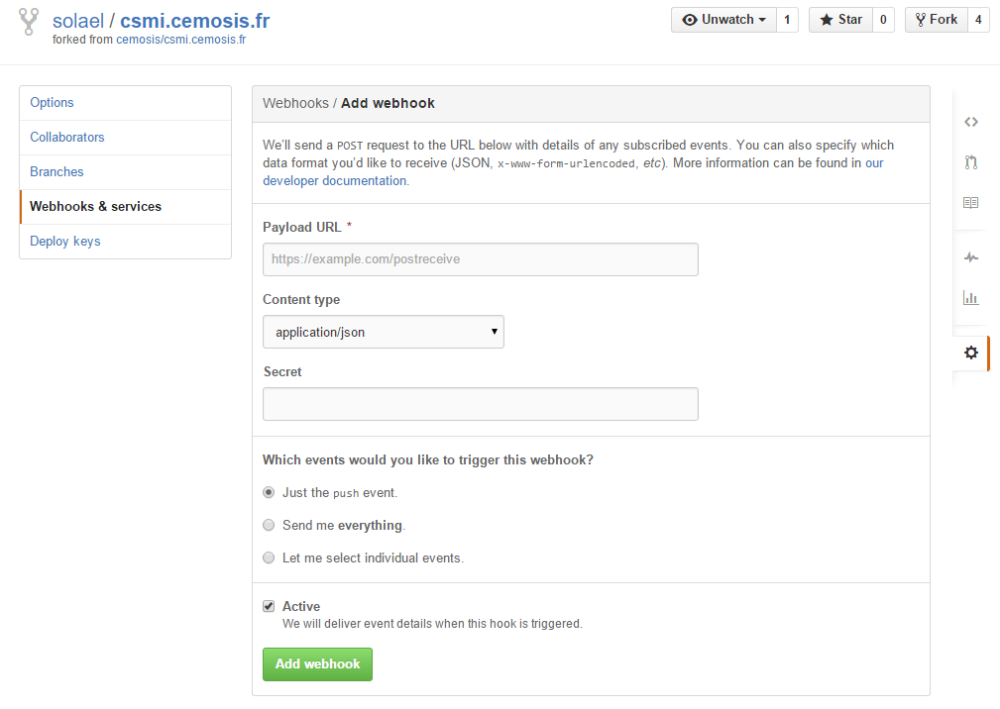

#Github Webhooks As A Web Service
Github Webhooks is a web service provided by Github as an integrated functionality in any Github repository. With a simple configuration in repository's settings, Github will send a POST request to URLs that I provided in settings. Which allow external services to be notified when events happen within websites' repositories. 

When a commit event is triggered, Github will send a HTTP POST payload to the webhook’s configured URL. Webhooks can be used to update an external issue tracker, trigger CI builds, update a backup mirror, or even deploy to production server.

In our case, we want the `csmi.math.unistra.fr` server to be notified when there is a new commit to any of our websites and when there is a new commit to the `news` repository.




An real example of delivered webhook:

Payload wrote in JSON sent in HTTP message body:
```json
{
  "ref": "refs/heads/gh-pages",
  "before": "2253d4ba8ad22472255806f62381a964d3ce7982",
  "after": "08268c090115d627b3a70c37e513505ec0d8bdb3",
  "created": false,
  "deleted": false,
  "forced": false,
  "base_ref": null,
  "compare": "https://github.com/solael/solael.github.io/compare/2253d4ba8ad2...08268c090115",
  "commits": [
    {
      "id": "08268c090115d627b3a70c37e513505ec0d8bdb3",
      "distinct": true,
      "message": "gh-pages update",
      "timestamp": "2015-08-27T04:10:11-04:00",
      "url": "https://github.com/solael/solael.github.io/commit/08268c090115d627b3a70c37e513505ec0d8bdb3",
      "author": {
        "name": "solael",
        "email": "yuheng.zhao067@gmail.com",
        "username": "solael"
      },
      "committer": {
        "name": "solael",
        "email": "yuheng.zhao067@gmail.com",
        "username": "solael"
      },
      "added": [

      ],
      "removed": [
        ".gitattributes",
        ".gitignore"
      ],
      "modified": [
        "README.md"
      ]
    }
  ],
  "head_commit": {
    "id": "08268c090115d627b3a70c37e513505ec0d8bdb3",
    "distinct": true,
    "message": "gh-pages update",
    "timestamp": "2015-08-27T04:10:11-04:00",
    "url": "https://github.com/solael/solael.github.io/commit/08268c090115d627b3a70c37e513505ec0d8bdb3",
    "author": {
      "name": "solael",
      "email": "yuheng.zhao067@gmail.com",
      "username": "solael"
    },
    "committer": {
      "name": "solael",
      "email": "yuheng.zhao067@gmail.com",
      "username": "solael"
    },
    "added": [

    ],
    "removed": [
      ".gitattributes",
      ".gitignore"
    ],
    "modified": [
      "README.md"
    ]
  },
  "repository": {
    "id": 27333619,
    "name": "solael.github.io",
    "full_name": "solael/solael.github.io",
    "owner": {
      "name": "solael",
      "email": "yuheng.zhao@ensiie.fr"
    },
    "private": false,
    "html_url": "https://github.com/solael/solael.github.io",
    "description": "",
    "fork": false,
    "url": "https://github.com/solael/solael.github.io",
    ...
  },
  "pusher": {
    "name": "solael",
    "email": "yuheng.zhao@ensiie.fr"
  },
  "sender": {
    "login": "solael",
    "id": 5739702,
    "avatar_url": "https://avatars.githubusercontent.com/u/5739702?v=3",
    "gravatar_id": "",
    "url": "https://api.github.com/users/solael",
    ...
  }
}
```