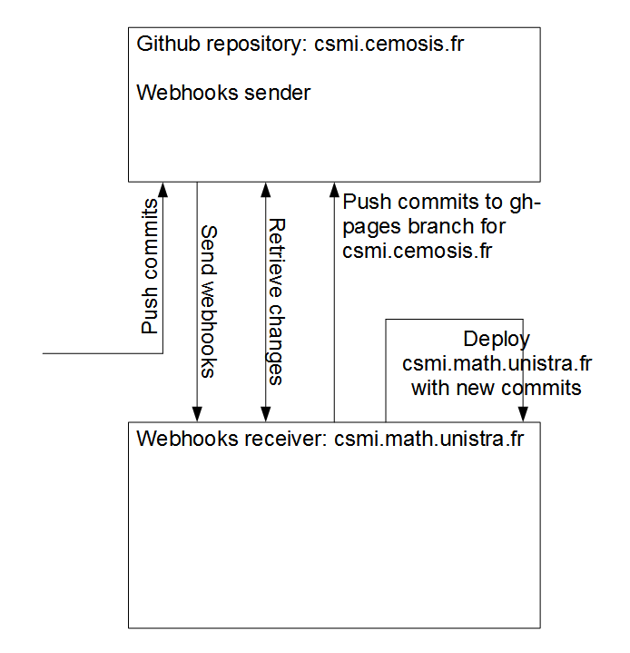
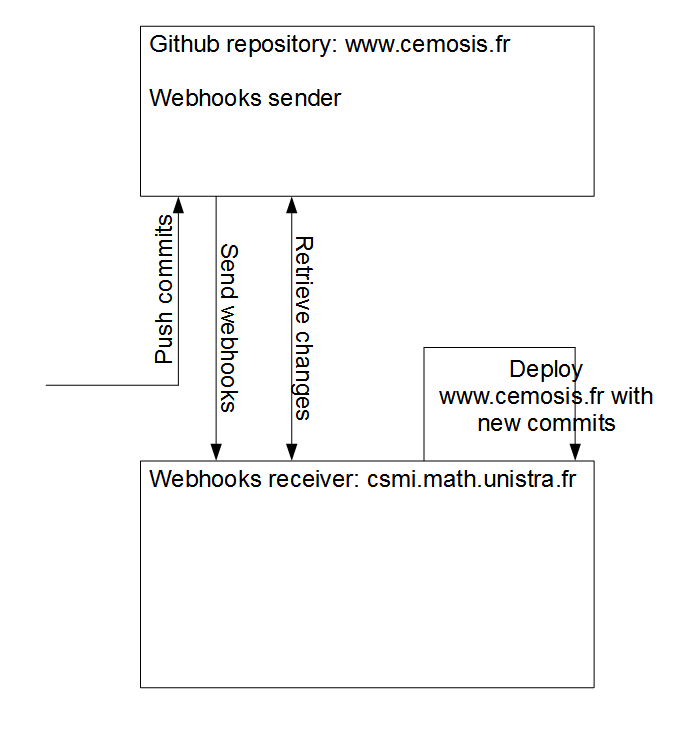
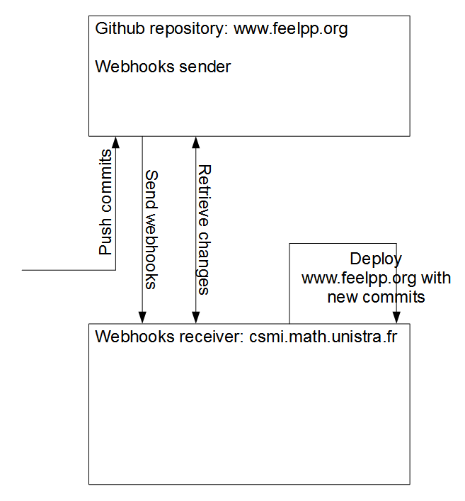
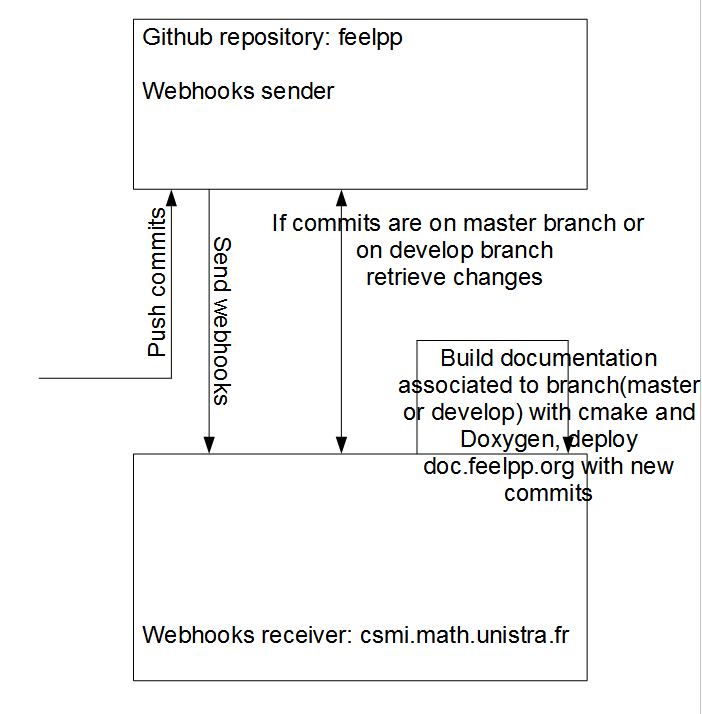

#Setup Web Service
I found an existing Github repository called [`jekyll-hook`](https://github.com/developmentseed/jekyll-hook) developed by [Development Seed](https://developmentseed.org/), which is an open source project under BSD license. It was originally designed to work only with Github's gh-pages branch for single personal Github blog. I extended its capacity to work with several websites and to work with `News` subtree repository.

The program `jekyll-hook` is in fact a Node.js back-end server that can receive and parse information from Github Webooks. Work under Ubuntu system, It can also be trigger by Webhooks to execute sh scripts in order to accomplish different missions.

As we need a permanent web service on our server, I used [Upstart](http://upstart.ubuntu.com/) to start Webhooks service during boot and supervising it while the Ubuntu system is running.

##Webhooks for csmi.math.unistra.fr and csmi.cemosis.fr

##Webhooks for www.cemosis.fr

##Webhooks for www.feelpp.org

##Webhooks for doc.feelpp.org

A code level detailed guide is available in [Appendix/Setup Webhooks As A Upstrat Service With Node.js And Bash Scripts](../Appendix/webhook.md).