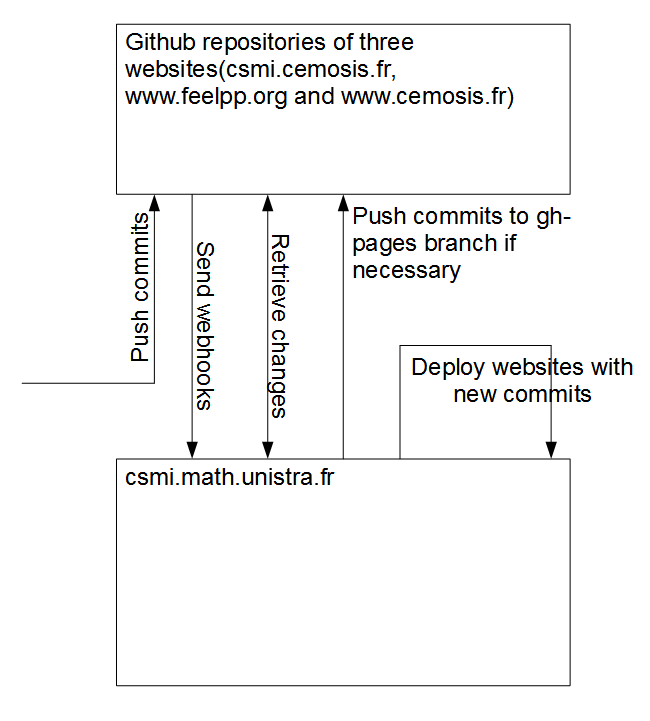
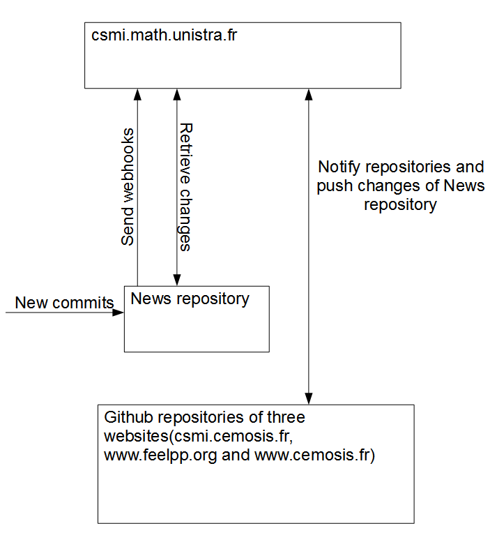

#Working With Github Webhooks
##Working with webhooks powered websites
As the webhooks sender and receiver are both ready to work, we can just push commits to website source code repositories on Github as usual. Github will send webhooks to our server `csmi.math.unitra.fr`. And then the web service set up on our server will build and deploy our websites automatically.

##Working with `news` repository
The `news` repository is centerlized repository that contains markdown files of all three websites, so it's necessary to push commits on priority to this repository then let our web service powered by Node.js and Upstart to notify three websites' repositories and sychronise all changes in `news` repository.

Since websites repositories have their own webhooks, so here comes a repetition of website workflow mentioned above.
Alternatively, if I want to make changes locally under `_posts` directory, I should always notify and push firstly to the original `news` repository on Github by using command line. Then the webhooks service will do the rest.