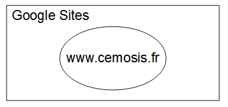
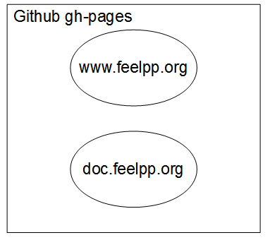
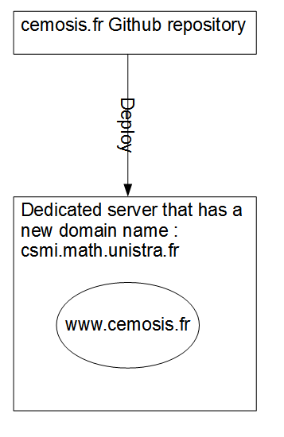
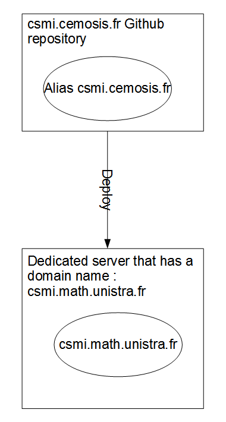
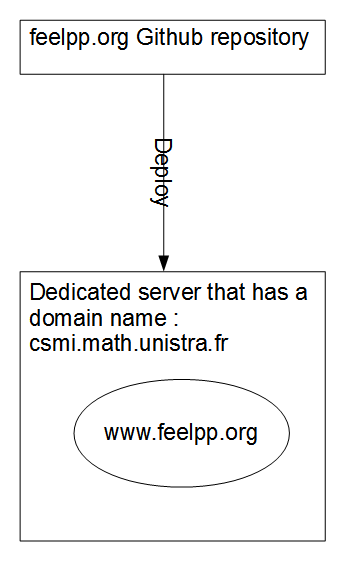
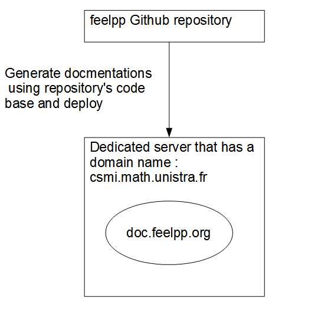
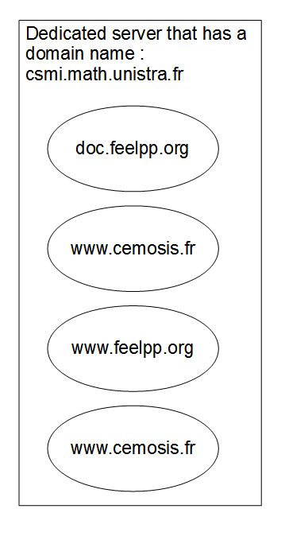

#Websites Organization
The following schemas explain how all the websites are going to be deployed and hosted.

## Before migrations
### www.cemosis.fr on Google Sites

### www.feelpp.org and doc.feelpp.org hosted their on their Github repositories' `gh-pages` branch

## After migrations
A virtual machine on Amazon Web Services was provided by IRMA, a domain name belongs to the university was also allocated to that machine.
For each website hosted on that machine that has a different domain name, its domain name will point to the machine's IP address. After that Nginx web server installed on that machine will handle the redirections between several different websites.
### www.cemosis.fr on the machine `csmi.math.unistra.fr` 

The website of Master CSMI will be deployed on that machine and an extra copy(alias csmi.cemosis.fr) will also be deployed on its Github repository's `gh-pages` branch.
### csmi.math.unistra.fr on the machine `csmi.math.unistra.fr` and csmi.cemosis.fr on Github `gh-pages` branch

### www.feelpp.org on the machine `csmi.math.unistra.fr`

### doc.feelpp.org on the machine `csmi.math.unistra.fr`

##Final schema on the machine `csmi.math.unistra.fr`

