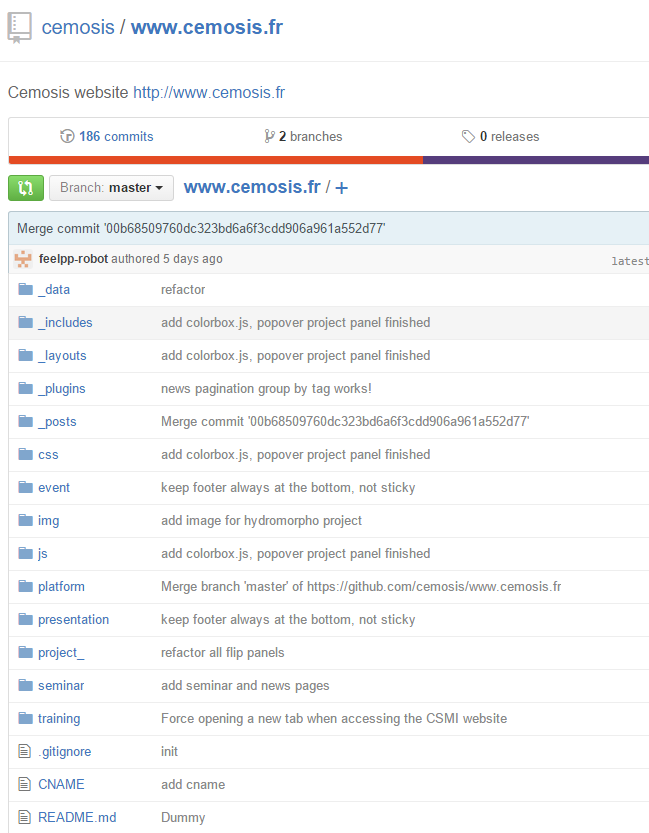

#News Repository As A Git Subtree
As mentioned in the section before, all three websites(feelpp.org, csmi.math.unistra.fr and www.cemosis.fr) that I mainly worked on have a folder `_posts` under its source code root directory. In this folder, all `posts` wrote in `Markdown` will be parsed by Jekyll to generate associated HTML page.
What we want is figuring out a way to easily maintain these three folders. So here comes an idea that I put the contents in three folders into a single one folder always called `_posts`. As the name `_posts` is a mandatory of Jekyll's file structure. Now it contains three sub folders for each websites:
`_posts`
|-- csmi
|-- cemosis
|-- feelpp
Briefly I migrated all Markdown files from old `_posts` folders into appropriate sub folders.

The source code of website is managed by the famous version control tool called `Git`. As a result, I deleted three old `_posts` folders and untrack them in Git project tree.
Now the question is: how to integrate this new, merged `_posts` folder into each website.
With Git, we get two choices: one is the `Git Submodule` and the other is `Git subtree`.
They all have similar functionality: keep an isolated Git repository under another Git repository. In this way,  the news folder can be shared within three websites.
We chose Git subtree as our final decision, because Git  submodule has many downsides handling a repository that going to be frequently updated. Unlike Git submodule, it stores the files in the main repository(the website source code repositories) and merging changes directly to that repository. Which means Git subtree will copy the new `_posts` folder from its original `news` repository on Github under each main repository, then Git will track on extra these local copies.

As the `news` subtree repository is stored locally in each main repository, the next important step is to keep them up to date with their origin: `news` repository itself hosted on Github. This can be achieved by using Github's Webhook service, which will be introduced in the next chapter of this report.

## Integrate news repository in three websites' code bases
The `news` repository itself on Github:

All three `_posts` directories are in fact local copies of original `news` repository.

