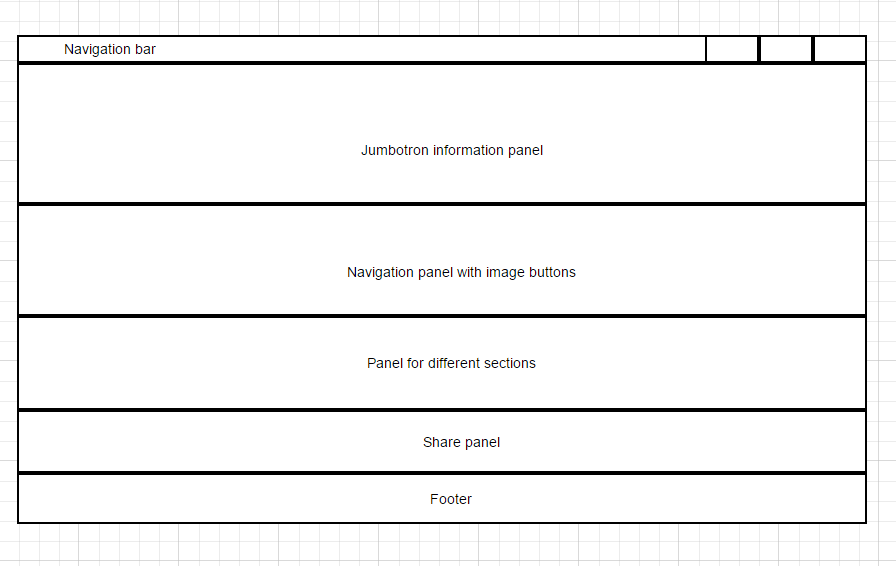
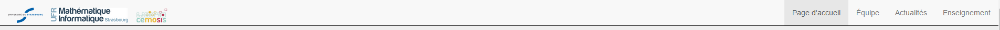
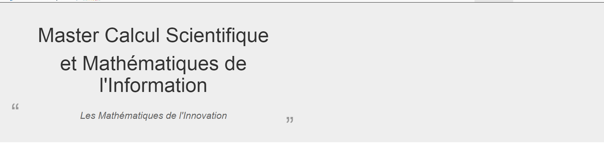
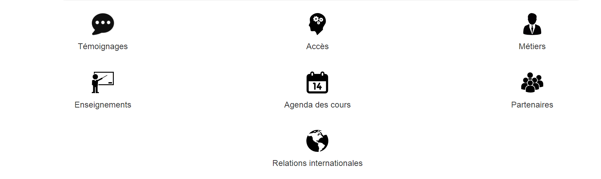
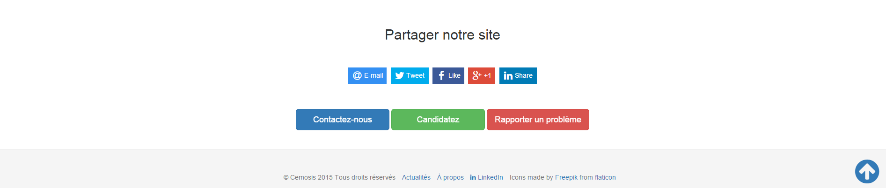

## The Bootstrap framework

Bootstrap is a free and open-source collection of tools for creating websites and web applications. It contains HTML- and CSS-based design templates for typography, forms, buttons, navigation and other interface components, as well as optional JavaScript extensions. The main adavantage of using Boostrap framework is that Boostrap designed to be reponsive, so its grid system helps us a lot to enhance the user experience on mobile devices. 

## The structure of CSMI website



As this mock-up shows, Bootstrap offers many useful components which can be employed to created them.

## Components and code

The navigation bar:

```html
  <nav class="navbar navbar-default navbar-fixed-top">
    <div class="container-fluid">
      <!-- Brand and toggle get grouped for better mobile display -->
      <div class="navbar-header">
        <button type="button" class="navbar-toggle collapsed" data-toggle="collapse" data-target="#main-navbar" aria-expanded="false">
        <span class="sr-only">Toggle navigation</span>
        <span class="icon-bar"></span>
        <span class="icon-bar"></span>
        <span class="icon-bar"></span>
      </button>

      <!-- logos -->
      <a class="navbar-brand" href="http://www.unistra.fr/">
        
      </a>
      <a class="navbar-brand" href="https://mathinfo.unistra.fr/">
        
      </a>
      </div>

      <a class="navbar-brand" href="http://www.cemosis.fr">
        
      </a>

      <!-- Navbar buttons -->
      <div class="collapse navbar-collapse" id="main-navbar">

        <ul class="nav navbar-nav navbar-right">
          <!-- auto active current page -->
          <li class="active"><a href="/index.html">Page d'accueil</a></li>
          <li class="active"><a href="/team">&Eacute;quipe</a></li>
          <li class="active"><a href="/news">Actualités</a></li>
          <li class="active"><a href="/course">Enseignements</a></li>
      </div><!-- /.navbra-collapse -->
```



```html
<div class="jumbotron" style="border-bottom: 1px solid black">
  <div class="container-fluid">
    <div class="row-fluid">
      <div class="col-md-6">
        
        <h1>Master Calcul Scientifique</h1>
        <h1 style="text-align:center">et Mathématiques de l'Information</h1>
          
        <blockquote class="testimonial"><h2>Les Mathématiques de l'Innovation</h2></blockquote>
            
      </div>
      

      <div class="col-md-6"></div>

    </div>
  </div>
</div>
```



```html
<div id="panel-sections" class="container-fluid">
  <div id="sections"class="centered">
    <div class="row-fluid">
      <div class="col-md-4" style="margin-top:50px">
      <a class="hvr-bounce-in" href="#testimony"></a>
        <h3>Témoignages</h3>
      </div>

      <div class="col-md-4" style="margin-top:50px">
        <a class="hvr-bounce-in" href="#access"></a>
        <h3>Accès</h3>
    </div>


      <div class="col-md-4" style="margin-top:50px">
         <a class="hvr-bounce-in" href="#metiers"></a>
         <h3>Métiers</h3>
      </div>
    </div>

    <div class="row-fluid">
      <div class="col-md-4" style="margin-top:50px">
        <a class="hvr-bounce-in" href="#course"></a>
        <h3>Enseignements</h3>
      </div>
      <div class="col-md-4" style="margin-top:50px">
        <a class="hvr-bounce-in" href="#agenda"></a>
        <h3>Agenda des cours</h3>
      </div>

      <div class="col-md-4" style="margin-top:50px">
        <a class="hvr-bounce-in" href="#partnership"></a>
        <h3>Partenaires</h3>
      </div>
    </div>
    <div class="row-fluid">
      <div class="col-md-4" style="margin-top:50px"></div>
      <div class="col-md-4" style="margin-top:50px">
        <a class="hvr-bounce-in" href="#international"></a>
        <h3>Relations internationales</h3>
      </div>
      <div class="col-md-4" style="margin-top:50px"></div>
    </div>
  </div>
</div>
```




```html
  <span class="anchor" id="access"></span>
  <div id="panel-access" class="container-fluid">
    <center>
      <div><h2>Comment accéder au Master? </h2></div>
    </center>

    <center>
      <div><h3>Quels sont les prérequis?</h3></div>
    </center>

    <div class="row-fluid">
      <div class="col-md-6" style="padding-top:50px">
        <h3 class="marketing-title">Analyse, Algèbre et Informatique</h3>
        <div style="text-align:center"><p>Vous avez de bonnes bases en analyse, en algèbre et en informatique.</p>
          
          <a href="mailto:contact-csmi@cemosis.fr" class="btn btn-primary hvr-pulse-grow" role="button" style="width:150px">Contactez-nous</a>
          <a href="https://aria.u-strasbg.fr/" class="btn btn-success hvr-pulse-grow" role="button" style="width:150px">Candidatez</a>
          
          <p style="margin-top:30px"> Une mise à niveau en informatique pourra être dispensé. </p>
        </div>
      </div>
      <div class="col-md-6" style="padding-top:50px">
        <h3 class="marketing-title">Programmation, Algorithmique et Applications</h3>
        <div style="text-align:center">
          <p>Vous aimez ou avez appréciez la programmation, l'algorithmique et les applications des mathématiques. </p>
          <a href="mailto:contact-csmi@cemosis.fr" class="btn btn-primary hvr-pulse-grow" role="button" style="width:150px">Contactez-nous</a>
          <a href="https://aria.u-strasbg.fr/" class="btn btn-success hvr-pulse-grow" role="button" style="width:150px">Candidatez</a>
        </div>
      </div>
    </div>
  </div>
```


These kind of panels are all created with container-fluid components. It have 100% width of viewport. Which fits our demand.

```html
    <div class="container-fluid" style="padding-top:50px">
      <center><h2>Partager notre site</h2></center>
      <div id="share" class="centered" style="margin-top: 50px"></div>

      <center style="margin-top:50px">

      <a href="mailto:contact-csmi@cemosis.fr" class="btn btn-primary btn-lg hvr-pulse-grow" role="button" style="width:200px">Contactez-nous</a>

      <a href="https://aria.u-strasbg.fr/" class="btn btn-success btn-lg hvr-pulse-grow" role="button" style="width:200px">Candidatez</a>

      <a href="https://github.com/cemosis/csmi.cemosis.fr/issues" class="btn btn-danger btn-lg hvr-pulse-grow" role="button" style="">Rapporter un problème</a>

      </center>
    </div>
```

```html
<footer>
  <div class="container">
    <div class="row">
      <ul class="footer-links">
        <li>
          <p style="padding-top:20px">&copy; Cemosis 2015 Tous droits réservés</p>
        </li>
        <li>
          <a href="/about">&Agrave; propos</a>
        </li>

        <li>
          <a href="https://www.linkedin.com/groups?home=&gid=3923807&trk=anet_ug_hm"><i class="fa fa-linkedin"></i>&nbspLinkedIn</a>
        </li>
        <li>
          <p>Icons made by <a href="http://www.freepik.com/">Freepik</a> from <a href="http://www.flaticon.com">flaticon</a></p>
        </li>
      </ul>
    </div>
  </div>

</footer>
```
