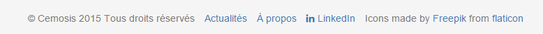
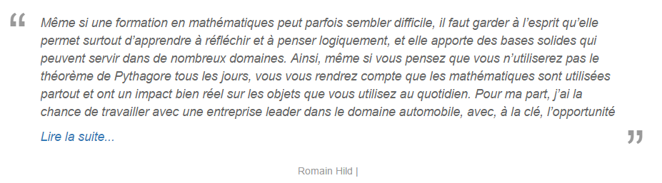

## Font-awesome framework

Font Awesome is a full suite of 519 pictographic icons for easy scalable vector graphics on websites, created and maintained by Dave Gandy. To avoid design some icons by myself, i use this framework to help set up an LinkedIn link in the website's footer, a back-to-top button fixed at the bottom of viewport, and several icons for the share buttons.

### installation

```html
<link rel="stylesheet" type="text/css" href="https://maxcdn.bootstrapcdn.com/font-awesome/4.3.0/css/font-awesome.min.css">
```

## Usage and result

```html
<a href="https://www.linkedin.com/groups?home=&gid=3923807&trk=anet_ug_hm"><i class="fa fa-linkedin"></i>&nbspLinkedIn</a>
```




```html
<!-- Return to top arrow -->
<a href="#" class="back-to-top" style="display: inline;">
  <i class="fa fa-arrow-circle-up fa-6"></i>
</a>
```


The share buttons are generated by jsSocials.js. It used aslo font-awesome framework's icons.

```html 
<!DOCTYPE html>
<html>
<head>
    <link rel="stylesheet" type="text/css" href="font-awesome.css" />
    <link rel="stylesheet" type="text/css" href="jssocials.css" />
    <link rel="stylesheet" type="text/css" href="jssocials-theme-flat.css" />
</head>
<body>
<!-- jsSocial share buttons -->
<script>
  $("#share").jsSocials({
      shares: ["email", "twitter", "facebook", "googleplus", "linkedin"],
      url: "https://csmi.cemosis.fr/",
      text: "Master mention Mathématiques et Applications, Spécialité Calcul Scientifique et Mathématiques de l'Information",
      showLabel: true,
      showCount: true
  });
</script>
</body>
</html>
```

## Readmore.js

Readmore.js is a smooth, responsive jQuery plugin for collapsing and expanding long blocks of text with "Read more" and "Close" links. I used it to collapse ant expand all the quoted testimonies.

## Usage


```html
<script src="https://code.jquery.com/jquery-1.11.3.min.js"></script>
<script src="/js/readmore.min.js"></script>
```

It must be included after jquery.

```html
   <!-- read more option's code, using Readmore.js -->
    <script type="text/javascript">
      $('#testimony-0').readmore({
        collapsedHeight: 150,
        lessLink: '<a href="#">Lire moins</a>',
        moreLink: '<a href="#">Lire la suite...</a>'  
      });
      $('#testimony-1').readmore({
        collapsedHeight: 150,
        lessLink: '<a href="#">Lire moins</a>',
        moreLink: '<a href="#">Lire la suite...</a>'  
      });
      $('#testimony-2').readmore({
        collapsedHeight: 150,
        lessLink: '<a href="#">Lire moins</a>',
        moreLink: '<a href="#">Lire la suite...</a>'  
      });
      $('#testimony-3').readmore({
        collapsedHeight: 150,
        lessLink: '<a href="#">Lire moins</a>',
        moreLink: '<a href="#">Lire la suite...</a>'  
      });      
    </script>
```

The code calls readmore() function with the 4 testimonies currently put in the index page. The collapsedHeight will determine if the text zone need to be collapsed. And the lessLink and moreLink are just fake links to interacts with user.


